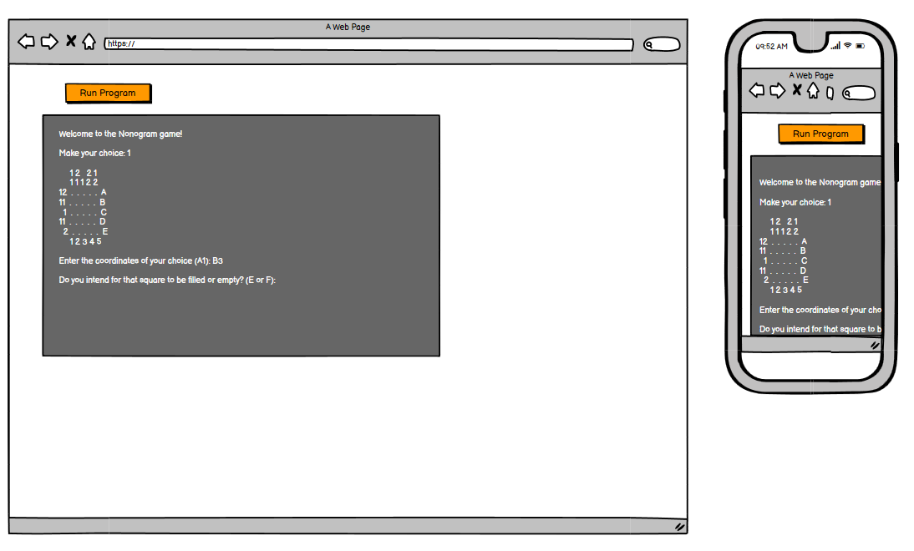

<h1 align="center">The Nonogram Game</h1>

This is a small interactive game with a command line interface. The logic behind the game is done in Python and the project is a part of the Code Institute Full Stack Developer Course.
A Nonogram game challenges the mind when it comes to logical thinking. The original intent of a Nonogram is to reveal an actual motif but this game reveals a random pattern thus offering an “endless” number of different challenges. 
To learn more about Nonograms, read about it on [Wikipedia](https://en.wikipedia.org/wiki/Nonogram).  
[View the live project here](https://hj-nonogram-game.herokuapp.com/).

## Table of Contents
**[User Experience](#user-experience)**  
**[Planning the Project](#planning-the-project)**  
**[Features](#features)**  
**[Technologies Used](#technologies-used)**  
**[The Code](#the-code)**  
**[Testing](#testing)**  
**[Deployment](#deployment)**  
**[Credits](#credits)**  
**[Conclusion](#conclusion )** 

## User Experience
### User's Goal
- As a user I want to clearly understand the purpose of the game.
- As a user I want to have the option to select the difficulty level of the game.
- As a user I want to be able to quit or restart the game at any point.
- As a user I want the result of the game played, displayed on the terminal. 
- As a user I always want to get a clear response to my input in the terminal.

### Site Owner’s Goal
- The site owner’s goal with this project is to provide a game that challenges the mind of the player and in the process improve her Python programming skills.

## Planning the Project
### Wireframes
Since this project is focusing on Python programming, the User Interface, a mock terminal on Heroku, is premade in the template provided by Code Institute. There is also no focus on getting the app responsive but I still made the wireframes to get a picture of what the project would look like.  

### Flow Chart
To plan the logic of the game I made a flowchart on [Lucidchart](https://www.lucidchart.com/pages/).

The logic of the game consists mainly of one loop that draws the board on the screen and asks the player for the next coordinate and whether it is supposed to be filled or empty, and then redraws the board again. The loop goes on until the player chooses to quit, restart or finish the game or until the board is full.   
Under Features you can read about the functionality of the game.

## Features
### Existing Features
- The start menu offers the user two options. The user can choose between: 
  - Reading about how the game is played.
  - Play the game.  

- On the how to play menu page the player has three options:
  - Read about how a Nonogram works.
    - Common rules of a Nonogram are described for those who haven't tried one before.
  - Read about how this particular game is played.
    - A description of how this game is played can be found here. The user can read about how coordinates are used to fill the pattern and how to leave or replay the game etc.
  - Go back to the main menu.  

- If the user chooses to play the game they will face a question where the user is expected to enter the size of the board.    

- Next the actual game board appears. It provides these features:
  - On top of the screen the options to end the game are shown. The player can always type Q to quit the game, R to empty the board and restart the game or X when the player considers the game to be finished and wants to see the result.
  - The game board with these features:
    - The headers on top and on the left which gives the player a guide to how the pattern should be filled.
    - The letters and numbers on the right and on the bottom which show the coordinates of the board.
    - The game board, consisting of dots which are replaced by squares as the game goes on. 
  - Input rows on the bottom asks the player to enter which coordinate to mark with a square and if the square should be filled or empty.
  - The game goes on until the board is filled with squares or the player types Q, R or X, according to above.
  - When the game is finished the player gets a message stating the number of errors the board contained.   

- When the game is finished the player gets the choice of either playing the same game again or going back to the main menu.   

- All through the game, the player gets a confirmation after an input has been made. Either by getting the right response or an error message which states the problem with the input.

### Features Left to Implement
- In the future I would like to add a feature where the user can choose to not get a random pattern but to get an actual image when the game is finished.
- I would like to solve the problem which allows the game to give multiple solutions. See left bugs below.

## Technologies Used

### Languages Used
-   Python

The technologies below are used in the project but were already added in the template provided by Code Institute. 
-   HTML
-   CSS
-   JavaScript

### Programs Used
- The [Gitpod](http://gitpod.io) terminal was used for writing the code, committing it to Git and pushing it to GitHub.
- [Git](https://git-scm.com/) was used for version control.
- [GitHub](https://github.com/) is used to store the project's code.
- [Heroku](https://www.heroku.com/) was used for deployment of the app.
- [Balsamiq](https://balsamiq.com/) was used to create the wireframes during the design process.
- [Lucidchart](https://www.lucidchart.com) was used to draw the flowchart.

## The Code
I decided to write the Python code in this project using functions. The code is divided into different files to make it more user friendly. I thought a long time about whether I should make the pattern variables and the size variable global or not, but after discussions with tutors and others I finally decided to go for passing the variables instead of making them global. I am still not sure of which way is best in this particular case, but even if this meant passing some variables through functions where they are not needed it worked fine in the end.

- **run.py**: contains only one row which calls the run_game() function in run_game.py.
- **run_game.py**: contains the starting functions of the game. It prints the start menu and how to play menu and asks the initial questions to the player. Here are the initial patterns created. Both the randomized game pattern and the "empty" player pattern. The function play_game() can also be found here. It contains the while loop that runs the actual game. 
- **game_board.py**: contains the functions which prints the game board. It is called by the play_game function. Most of the functions in this file are used to calculate and print the headers of the game. The headers contain all the information the user needs to solve the puzzle.
- **game_entry.py**: the main function in this file is called from the play_game function after the board has been drawn on the screen. It asks the player for new inputs and updates the player pattern and returns it to the play_game function.
A lot of code in this file checks the inputs to catch input errors.
- **compare.py**: contains functions to evaluate the game result when the game is finished and display it to the player.
- **end_game.py**: contains functions to give the player options at the end of the game.
-**clear_screen**: contains only one function which is called from different parts of the program to clear the terminal.

## Testing
Testing was continuously performed throughout the development process. Every new function was tested by printing results in the terminal window and all new inputs were tested to ensure the correct response.
Once the app was finished all the functionalities were run to make sure the result was correct.
The built-in checker in GitPod let me take care of the PEP8 warnings on the fly and resulted in no warnings or errors in the PEP8 online checker.
- **Python:** All python files were run through [PEP8 online](http://pep8online.com/), and no errors were found.  
Screenshots of the test results of all the files can be found ![here].

### Testing User Stories from User Experience (UX) Section

- #### Testing User's Goal
  - The user can easily find a description of the game and how it is played under the how to play section.  
  The commands to quit, restart or finish the game are visible above the game board throughout the game.
  - The user can choose the difficulty level of the game by changing the size of the game board.
  - The user can, at any time in the game, type Q, R or X to end, restart or finish the game.
  - When the game is finished, either by players choice or because the board is full, the result of the game is printed. The result is the number of errors on the players board.
  -The player always gets some confirmation after an input has been made and a clear error message when the input was not correct.

- #### Testing Site Owner's Goal
  - The game can be quite challenging, especially when playing a larger board.
  - The site owner has definitely improved her Python skills during this project.

### Known Bugs
Even though it took me a while to discover it and it is definitely not a common phenomenon, a major bug remains to be solved. There is nothing in the code that prevents a game board from containing multiple solutions. In the current solution a player can receive an error even if the board is correct because the pattern is not identical to the original pattern.
A solution to this problem was determined to be too complicated to fit into the scope of this project.

## Deployment
### Clone a GitHub repository
To make a local copy of this project you can make a clone by following these steps:
- Log in to GitHub and find the [repository](https://github.com/Odden69/nonogram_game).
- Above the list of files click on the code button. By the https address there is a copy symbol, click on that.
- Open Git Bash
- Change the current working directory to the location where you want the cloned directory.
- Type "git clone", and paste in the copied URL.
- Press Enter to create your local clone.

### Deploy to Heroku
This site was deployed to Heroku Apps. To deploy a site, follow these steps:
- Make sure you have correct requirements.txt and Procfile committed and pushed before moving on with the deployment.
- Log in to [Heroku apps](https://heroku.com/)
- On the Heroku dashboard go to the "New" menu and choose "Create new app".
- Give the app a name that needs to be unique, select your region and click "Create app".
- Now the new app's dashboard is opened. Click on the settings tab.
- When using this template from Code Institute a Config Var has to be set.
This is done by scrolling down to the Config Vars section and pushing "Reveal Config Vars".
- In the KEY field type PORT (with capital letters) and in the VALUE field type 8000 and push "Add".
- Scroll down to the Buildpacks section and push "Add build pack".
- It is important to select the buildpacks in the correct order so start with selecting python and click "Save changes". Then add another buildpack and then select nodejs.
- In the Deployment section select GitHub and click on "Connect to Github".
- Search for the Github repository you want to connect and click connect.
- Scroll down to the deploy sections. Choose either automatic or manual deployment. Click on Enable Automatic Deploys or Deploy Branch depending on your choice. 
- Wait until the app is built and the View button appears.
- Click on "View" to open the browser page with your app.

## Credits
### Code
Apart from finding inspiration in the course material from Code Institute I got a lot of general information about Python on [stackoverflow](https://stackoverflow.com/).

- How to achieve the printed filled and empty squares on the board was found on [stackoverflow](https://stackoverflow.com/questions/10635226/python-how-to-print-a-block-using-ascii-219-in-mac). A [chart](https://www.unicode.org/charts/PDF/U2B00.pdf) with different symbols was collected from [unicode](https://home.unicode.org/basic-info/overview/).
- To determine when the board is full and the game should automatically finish, the program has to check a list of lists for a specific element. This functionality was found on [kite](https://www.kite.com/python/answers/how-to-search-a-list-of-lists-in-python).
- How to efficiently replace items in a list was found on [PythonPool](https://www.pythonpool.com/replace-item-in-list-python/).
- How to clear the terminal, when the clear command was not sufficient, was found on [askubuntu](https://askubuntu.com/questions/25077/how-to-really-clear-the-terminal).
- How to open, read and close a text file using the path method was found on [stackoverflow](https://stackoverflow.com/questions/8369219/how-to-read-a-text-file-into-a-string-variable-and-strip-newlines).

### Other
- Wikipedia for the facts about Nonogram games.

## Acknowledgements
First I want to thank my Mentor, Narender Singh, for his support during the development process.   

The Code Institute tutoring team gave me support when I struggled with python in general.

My fellow slackers deserve, as usual, a big thank you for support and encouragement. No one mentioned, no one forgotten.  
And again, the team from Code Institute's 2021 Retro Gaming Hackathon ["Team Noiseland"](https://github.com/andrewdempsey2018/The-Never-Ending-Coding-Adventure-Codehog-Day) needs mentioning since I always get invaluable support from them and they have done a super job evaluating the game and trying to find bugs.

## Conclusion
To get a grip on Python has been a really big challenge for me. Before I started this project I had some serious doubts about my ability to finish it, but as the project went on my spirits went up. I now feel eager to dive deeper into the Python world.

[Back to the top](#the-nonogram-game)